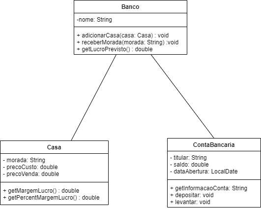

# Ficha-3 - Banco

Este projeto tem como objetivo em explicar o funcionamento de um banco
e as interações com as contas bancárias dos titulares e com as casas postas à venda. 

Um **banco** tem um ***nome*** e uma ***lista com todas as contas bancárias dos titulares*** e uma ***lista com todas as casas à venda disponíveis***. Um banco pode adicionar novas casas para serem vendidas e receber a sua respetivas moradas. Também pode saber o lucro previsto para cada venda de uma casa.

Uma **conta bancária** tem um ***titular***, um ***saldo*** e uma ***data de abetura da conta***. É possivel obter a informação sobre a conta bancária do titular e também é possível fazer depósitos e levantamentos a dinheiro.

Uma casa tem uma ***morada***, um ***preco de custo*** e um ***preco de venda***. Pode ser obtida a margem do lucro (diferença entre o preço de venda e o preço de custo) e a sua respetiva percentagem (razão entre o preço de venda e o preço de custo).

